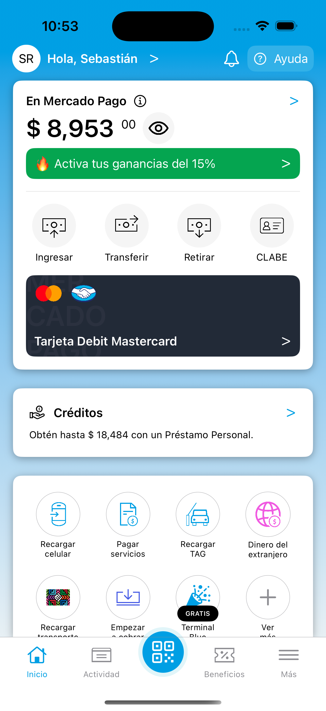

# Mercado Pago iOS App Clone



## 📱 Overview

This project is a **clone of the main interface** of the **Mercado Pago iOS App**, developed as part of a college assignment. The goal was to replicate the design and feel of the real app using **Swift** and **SwiftUI**, focusing on UI implementation rather than full functionality.

## 🎯 Objective

**Educational Purpose**: This project was created to practice building complex user interfaces with SwiftUI and to improve skills in developing iOS apps.

## 🖼️ Features

- 🛒 **Replicated UI**: Main Mercado Pago interface, including the home screen and key visual components.
- 📲 **Mobile Recharge Simulation**: A screen to simulate mobile phone recharges.
- 💸 **Recent Activity**: A screen to view recent transactions, displaying **incomes** and **expenses**.
- 🎨 **SwiftUI**: Fully built using SwiftUI to leverage its modern declarative syntax.
- 📱 **Responsive Layout**: Adaptive UI that works on different iOS devices.

## ⚙️ Installation

To try out the app, follow these steps:

1. Clone the repository:

    ```bash
    git clone https://github.com/4ubio/MercadoPagoiOSClone.git
    ```

2. Open the project in Xcode:

    ```bash
    open MercadoPagoClone.xcodeproj
    ```
    
3. Build and run the app on an iOS simulator or a physical device.
